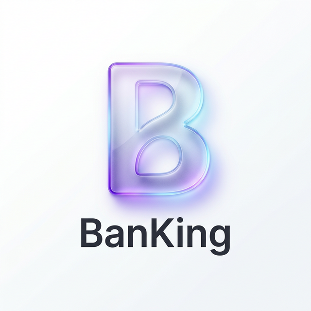

> No human touched a single line of code in this project (except for this notice).
> It was entirely generated by AI, for learning purposes only,
> almost autonomously burning tokens in OpenCode, Copilot, Claude Code and Antigravity.
> Here the human intervention ends.

---

<p align="center">
  <picture>
    <source media="(prefers-color-scheme: dark)" srcset="public/logo-dark.png">
    <source media="(prefers-color-scheme: light)" srcset="public/logo-light.png">
    
  </picture>
</p>

# BanKing

A personal banking application for importing and analyzing financial transactions from German bank accounts. Built with
Next.js 16 for local-first data management with zero cloud dependency.

## Overview

BanKing helps you manage and analyze your personal finances by connecting directly to your bank's API (currently DKB) to
import transactions automatically. All data is stored locally on your machine with no external transmission.

## Features

### Core Functionality

- **DKB API Integration**: Direct connection to DKB banking API for automatic transaction sync
- **Multi-Account Support**: Manage multiple bank accounts in one dashboard
- **Local Data Storage**: File-based database (LowDB) with SHA256 deduplication
- **Interactive Dashboard**: Real-time balance history, income vs expenses, spending categories
- **Advanced Filtering**: Filter transactions by date range, account, category, amount, and search
- **Transaction Management**: Full table view with sorting, pagination, and export-ready data
- **Financial Insights**: 17 KPI metrics including savings rate, burn rate, cash flow analysis
- **Demo Mode**: Test the app with realistic sample data before connecting your bank
- **Automatic Categorization**: Smart transaction categorization into 11 categories
- **AI Assistant**: Conversational analyst over your own local data, with inline charts/tables — see [AI Assistant](#ai-assistant) below

### Design & UI: Neo-Glass Theme

The application features a custom "Neo-Glass" aesthetic designed to feel premium and modern:

- **Dark Mode**: Deep midnight blue (`oklch(0.12 0.04 260)`) with neon accents and frosted glass cards
- **Light Mode**: Clean pearlescent white (`oklch(0.98 0.01 240)`) with soft, colorful shadows
- **Glassmorphism**: Extensive use of `backdrop-filter: blur()`, semi-transparent backgrounds, and subtle borders
- **Animations**: Smooth entry animations using Framer Motion
- **Responsive**: Mobile-first design from 320px to 1920px viewports

## Tech Stack

### Core Framework

- **Framework:** Next.js 16.1.4 (App Router, React 19)
- **React:** 19.2.3
- **TypeScript:** 5.x (strict mode enabled)
- **Node.js:** 20.x or later

### UI & Styling

- **Styling:** Tailwind CSS 4 with PostCSS integration
- **Components:** shadcn/ui (Radix UI primitives)
- **Icons:** Lucide React
- **Animations:** Motion (Framer Motion v12)
- **Theme:** next-themes with OKLCH color space
- **Fonts:** Geist Sans & Geist Mono (next/font)

### Data & Backend

- **Database:** LowDB (file-based JSON storage)
- **Validation:** Zod (runtime schema validation)
- **Charts:** ECharts + echarts-for-react
- **Dates:** date-fns (date manipulation)
- **Currency:** Intl.NumberFormat (EUR formatting)
- **Banking API:** DKB REST API with cookie + CSRF auth

### AI Assistant

- **SDK:** Vercel AI SDK (`ai` v7, `@ai-sdk/react` v4) for streaming chat + multi-step tool calling
- **Providers:** `@ai-sdk/openai`, `@ai-sdk/anthropic`, `@ai-sdk/google`, `ollama-ai-provider-v2` (all v4)
- **Config:** Local, gitignored `banking.config.json` (bring-your-own-key; never committed)

## Getting Started

### Prerequisites

- Node.js 20.x or later
- npm, yarn, pnpm, or bun
- DKB bank account (for live data sync) or use demo mode

### Installation

1. Clone the repository:

```bash
git clone <repository-url>
cd banking
```

2. Install dependencies:

```bash
npm install
```

3. Run the development server:

```bash
npm run dev
```

4. Open [http://localhost:3000](http://localhost:3000) in your browser

### Option 1: Use Demo Mode (Recommended for First-Time Users)

1. Open [http://localhost:3000](http://localhost:3000) in your browser
2. Toggle **Demo Mode** in the header (flask icon with switch)
3. Sample data with 6 months of realistic transactions will be generated automatically
4. Explore all features with demo data

### Option 2: Connect Your DKB Account

To sync real data from your DKB account:

#### Step 1: Extract Session Credentials

Create a file named `banking.config.json` in the project root (do NOT commit this file):

```json
{
  "dkb": {
    "cookie": "YOUR_COOKIE_STRING_HERE"
  }
}
```

#### Step 2: Trigger Sync

Make sure the dev server is running, then trigger a sync:

```bash
curl -X POST http://localhost:3000/api/sync
```

Your data will be imported and stored locally in `/data/db.json`. Refresh the dashboard to see your real transactions.

**Note:** DKB session credentials expire after 15-30 minutes of inactivity. When you get authentication errors, repeat
Step 1 to extract fresh credentials.

### Development Commands

```bash
npm run dev      # Start development server (localhost:3000)
npm run build    # Build for production
npm run start    # Start production server
npm run lint     # Run ESLint
```

### Production Deployment

For running BanKing as a persistent service (background process, Docker, etc.), see the full
[Deployment Guide](docs/DEPLOYMENT.md).

## AI Assistant

BanKing includes a conversational AI financial analyst at `/assistant`. It answers natural-language questions about
your own transactions by calling a set of read-only tools (account balances, category breakdowns, cash flow,
recurring expenses, savings rate, and more) over your local data, and can illustrate its answers with inline charts
and tables rendered directly in the chat.

### Setup

1. Open **Settings** and find the **AI Assistant** card.
2. Choose a **Provider** (OpenAI, Anthropic, Google Gemini, or Ollama for a fully local setup) and enter a **Model**
   name.
3. For OpenAI/Anthropic/Google, paste an **API Key**. For Ollama, set the **Base URL** instead (defaults to
   `http://localhost:11434`).
4. Click **Test Connection** to verify it works, then **Save**.
5. Open the **Assistant** page from the nav bar and start asking questions.

### Supported Providers

| Provider        | Recommended Model(s)                                                   | Notes                                                                                                                                                                                                                                                                                                                                                                           |
| --------------- | ---------------------------------------------------------------------- | ------------------------------------------------------------------------------------------------------------------------------------------------------------------------------------------------------------------------------------------------------------------------------------------------------------------------------------------------------------------------------- |
| OpenAI          | `gpt-4o`, `gpt-4o-mini`                                                | Requires an API key.                                                                                                                                                                                                                                                                                                                                                            |
| Anthropic       | `claude-sonnet-4-5`                                                    | Requires an API key.                                                                                                                                                                                                                                                                                                                                                            |
| Google (Gemini) | `gemini-2.5-flash`, `gemini-2.5-pro`                                   | Requires an API key.                                                                                                                                                                                                                                                                                                                                                            |
| Ollama (local)  | Any locally pulled function-calling-capable model (e.g. `llama3.1:8b`) | Zero-egress **only when the Base URL points to a local Ollama instance** (e.g. `http://localhost:11434`) — everything then runs entirely on your machine, no API key needed. If the Base URL is a remote Ollama server, requests (including transaction data) are sent to that server over the network. The model must support tool/function calling for the assistant to work. |

### Example Questions

- "How much did I spend on groceries last month?"
- "Show my spending trend over the past 6 months."
- "What are my biggest recurring expenses?"
- "Am I spending more than I earn?"
- "How long would my savings last without any income?"

### Privacy

Most tools return only aggregated, on-demand summaries — the specific figures needed to answer your question (e.g.
"Groceries: 412.50 EUR across 18 transactions"). The one exception is transaction search: when you ask about specific
transactions, the assistant may send up to 50 matching individual transaction rows (date, amount, description,
counterparty, category) to your chosen AI provider. These rows are capped at 50 and PII-stripped — no IBANs, account
or transaction IDs, cookies, or bank credentials are ever included, and descriptions are truncated to 200 characters.
The assistant only has **read-only** access to your data; it cannot modify, delete, or export anything. Choosing
Ollama with a local Base URL keeps everything — including individual transaction rows — entirely on your machine,
with zero data leaving it; a remote Ollama Base URL sends requests to that server instead (see Supported Providers
above).

## Project Structure

```
banking/
├── src/
│   ├── app/                    # Next.js App Router
│   │   ├── layout.tsx          # Root layout with theme provider
│   │   ├── page.tsx            # Dashboard with charts and KPIs
│   │   ├── globals.css         # Theme variables + Tailwind
│   │   ├── transactions/       # Transactions table with filters
│   │   ├── insights/           # Financial insights and analytics
│   │   ├── (dashboard)/assistant/ # AI Assistant chat page
│   │   ├── api/sync/           # DKB sync API endpoint
│   │   └── api/chat/           # AI Assistant streaming chat API
│   ├── components/
│   │   ├── ui/                 # shadcn/ui components (15+)
│   │   ├── layout/             # Header, Nav, Footer
│   │   ├── dashboard/          # Charts and KPI cards
│   │   ├── assistant/          # Chat message/input, visualization renderer + chart wrappers
│   │   ├── settings/           # Settings cards (incl. AI provider config)
│   │   ├── theme-provider.tsx  # next-themes wrapper
│   │   └── theme-toggle.tsx    # Dark/light mode toggle
│   ├── actions/                # Server actions
│   │   ├── accounts.actions.ts # Account queries
│   │   ├── transactions.actions.ts # Transaction queries
│   │   ├── stats.actions.ts    # KPI calculations
│   │   ├── sync.actions.ts     # DKB sync orchestration
│   │   └── ai.actions.ts       # AI config status/save/test-connection
│   ├── lib/
│   │   ├── db/                 # LowDB database layer
│   │   ├── banking/            # Banking adapters and sync
│   │   │   └── adapters/dkb/   # DKB API client
│   │   ├── stats/              # Statistics calculations
│   │   ├── ai/                 # AI provider factory, system prompt, 15 read-only tools, visualization schema
│   │   └── utils.ts            # Utility functions
│   ├── hooks/                  # Custom hooks (incl. chat persistence)
│   └── contexts/               # React contexts
├── docs/                       # Documentation
│   ├── PROJECT-STATE.md        # Current state checkpoint
│   ├── PRD.md                  # Product requirements
│   ├── DKB-API-SPEC.md         # DKB API docs
│   └── samples/                # Sample API responses
├── data/                       # Local database (gitignored)
├── next.config.ts              # Next.js configuration
├── tsconfig.json               # TypeScript configuration
├── eslint.config.mjs           # ESLint configuration
└── package.json                # Dependencies
```

## Configuration

### Path Aliases

The project uses TypeScript path aliases for cleaner imports:

```text
"@/*" -> "./src/*"
```

Example:

```typescript
import { Button } from "@/components/ui/button";
import { cn } from "@/lib/utils";
```

### Theme System

The app uses Tailwind CSS 4's native theme configuration with CSS custom properties. Theme tokens are defined in
`src/app/globals.css` and support both light and dark modes.

Key theme features:

- OKLCH color space for perceptually uniform colors
- CSS custom properties for runtime theme switching
- Automatic dark mode with `next-themes`
- Geist font family with variable fonts

### Code Style

- **Prettier:** Double quotes, trailing commas (ES5), 2-space indent
- **ESLint:** Next.js recommended config with TypeScript support
- **TypeScript:** Strict mode enabled with path aliases

## Data & Security

- **Local Only:** All data persists to `/data/db.json` (gitignored)
- **No Cloud:** Zero external data transmission except direct API calls to DKB
- **No Passwords Stored:** Authentication via session cookies (not stored in database)
- **Deduplication:** SHA256 hashing prevents duplicate transactions
- **Privacy First:** No analytics, no tracking, no third-party services

## Contributing

This is a personal project, but suggestions and feedback are welcome through issues.

## License

[License information to be added]

## Acknowledgments

- Built with [Next.js](https://nextjs.org/)
- UI components from [shadcn/ui](https://ui.shadcn.com/)
- Icons from [Lucide](https://lucide.dev/)
