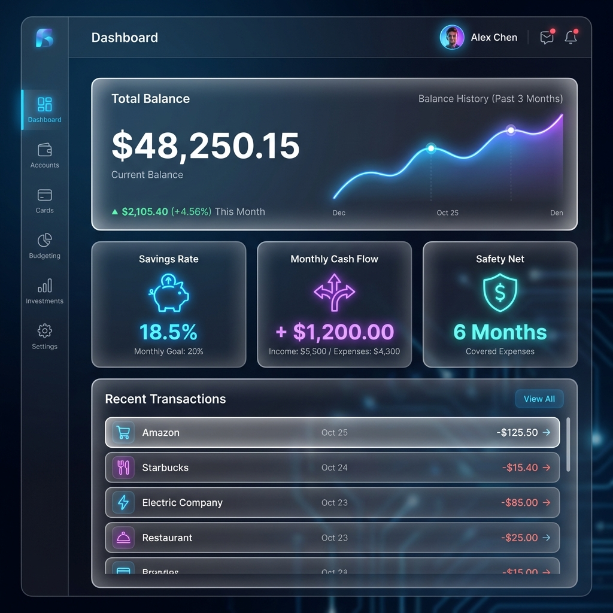
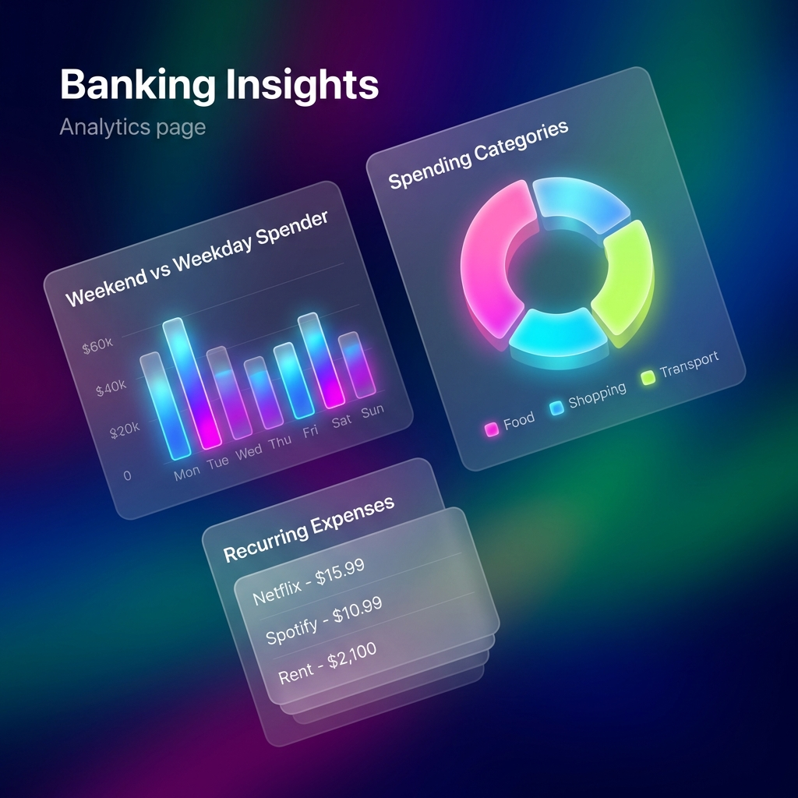

# Product Requirements Document: BanKing

**Version:** 1.0
**Status:** Draft
**Last Updated:** 2026-01-23

---

## 1. Product Overview

**BanKing** is a secure, local-only personal finance dashboard for German banking customers. It syncs account data from DKB via API (and later supports other banks), persists data locally using Next.js server-side file storage, and provides rich analytics with zero cloud dependency.

### 1.1 Design Philosophy

- **Privacy-first:** All data stays on the user's machine. No cloud, no external database.
- **Minimal configuration:** User pastes API credentials into a local config file; no login UI.
- **Extensible:** Clean unified banking interface allows adding new bank integrations without touching core logic.
- **Modern UX:** Neo-Glass aesthetic with responsive design (mobile & desktop).

---

## 2. Functional Requirements

### 2.1 Core Features

| ID | Feature | Description |
|----|---------|-------------|
| F1 | Multi-Bank Support | DKB (primary, multiple accounts) + Deutsche Bank (future) |
| F2 | Auto-Sync | Fetch accounts, transactions, and balances from DKB API on app start |
| F3 | Balance History | Store balances on each sync to build historical chart data |
| F4 | Total Balance | Aggregated balance across all accounts |
| F5 | Balance History Chart | Line/area chart showing balance over time |
| F6 | Income vs Expenses | Breakdown of money in vs money out per period |
| F7 | Spending Categorization | Auto-categorize transactions (groceries, bills, rent, etc.) |
| F8 | Transaction Filtering | Filter by date range, category, account, amount |
| F9 | Date Range Selection | Flexible custom date picker with presets (7d, 30d, This Month, Last Month, This Year, Last Year) |
| F10 | Average Monthly Metrics | Rolling averages for income, expenses, savings |
| F11 | Demo Mode | UI toggle to explore dashboard with sample data (no DKB connection needed) |
| F12 | Local Persistence | LowDB file-based storage via Next.js server actions |
| F13 | Global Account Filter | KPIs and Charts respect a global "Account Context" (All, Single, or Multi-select) |

### 2.2 Extended KPI Metrics (Research-Driven)

Based on personal finance analytics research, the following additional metrics provide significant value:

| ID | Metric | Definition | Calculation | Visualization |
|----|--------|------------|-------------|---------------|
| K1 | Monthly Cash Flow | Net surplus/deficit per month | Income - Expenses | **Trend Bar Chart** (Green/Red bars) |
| K2 | Savings Rate | % of income retained | (Income - Expenses) / Income * 100 | **Radial Progress / Donut** (Target: 20%) |
| K3 | Personal Burn Rate | Speed of spending beyond earnings | Expenses - Income (when negative cash flow) | **Sparkline / Text Alert** (Red text) |
| K4 | Emergency Fund Coverage | Months of expenses covered by liquid balance | Total Balance / Avg Monthly Expenses | **Gauge Widget** (Green zone > 3 months) |
| K5 | Expense Volatility | Stability of monthly spending | Std deviation of monthly expenses | **Line Chart** (Variance area) |
| K6 | Income Stability | Consistency of income sources | Std deviation of monthly income | **Line Chart** (Stability trend) |
| K7 | Top Spending Categories | Ranked breakdown of where money goes | Category totals, sorted descending | **Horizontal Bar Chart / List** |
| K8 | Recurring Expenses Ratio | % of spend that is fixed/recurring | Recurring / Total Expenses * 100 | **Stacked Bar** (Fixed vs. Variable) |
| K9 | Discretionary Spend Ratio | % of spend that is optional | Discretionary / Total Expenses * 100 | **Pie Chart** |
| K10 | Month-over-Month Trend | Spending trajectory | (This Month - Last Month) / Last Month * 100 | **Indicator Arrow** (Green/Red %) |
| K11 | Largest Single Expense | Biggest transaction in period | max(transaction.amount) where amount < 0 | **Text Highight / Card** |
| K12 | Daily Average Spend | Average daily outflow | Total Expenses / Days in Period | **Big Number Display** |

### 2.3 Behavioral Insights Metrics (New)

These metrics focus on user habits, timing, and financial resilience, visualized in the "Insights" view.

| ID | Metric | Definition | Calculation | Visualization |
|----|--------|------------|-------------|---------------|
| B1 | Weekend vs. Weekday Spender | Spending intensity comparison | Sat/Sun Total vs. Mon-Fri Total (Normalized by day count) | **Bar Chart / Heatmap** (2 bars side-by-side) |
| B2 | Financial Pulse (Payday Spike) | Spending velocity relative to income arrival | Daily spend graph overlaid with income events | **Sparkline** with peak markers |
| B3 | Safety Net Coverage | How long you can survive on current liquidity | Total Liquid Assets / (Avg Monthly Expenses - Discretionary) | **Gauge / Shield Icon** (Months) |
| B4 | Recurring Expense Ratio | "Subscription Bloat" indicator | (Recurring Transactions + Subscriptions) / Total Expenses | **Stacked Bar** (Fixed vs. Variable) |
| B5 | Impulse Purchase Potential | High-value transactions in "Wants" categories | Count/Sum of transactions > X EUR in discretionary categories | **Scatter Plot** (Amount vs. Time) |

### 2.3 Demo Mode

- Toggle accessible from settings/header
- Generates realistic sample data: 2 accounts, 6 months of transactions
- Covers all categories with natural variance
- Allows full dashboard exploration without real credentials

---

## 3. Technical Architecture

### 3.1 Stack

| Layer | Technology |
|-------|-----------|
| Framework | Next.js 16.1.4 (App Router, React 19) |
| Language | TypeScript 5 (strict mode) |
| Styling | Tailwind CSS 4, shadcn/ui |
| Validation | Zod |
| Database | LowDB (file-based JSON) |
| CSV Parsing | PapaParse (future, for Deutsche Bank) |
| Charts | ECharts (via echarts-for-react) |
| Date Handling | date-fns |
| Currency | currency.js or Intl.NumberFormat |
| Animations | Framer Motion (motion) |

### 3.2 Data Flow

```
┌─────────────────────────────────────────────────────────┐
│                    APP START                              │
│                                                          │
│  1. Read credentials from local config                   │
│  2. Call DKB API endpoints (server-side only)            │
│  3. Map DKB responses → Unified Interface (via Zod)     │
│  4. Persist to LowDB (accounts, transactions, balances) │
│  5. Serve dashboard via server components                │
└─────────────────────────────────────────────────────────┘

┌─────────────────────────────────────────────────────────┐
│                   UNIFIED INTERFACE                       │
│                                                          │
│  Account { id, name, type, institution, currency }       │
│  Transaction { id, accountId, date, amount, ... }        │
│  Balance { accountId, amount, date, currency }           │
│  Institution { id, name, adapter }                       │
└─────────────────────────────────────────────────────────┘
```

### 3.3 Unified Banking Interface

Inspired by Plaid's API structure but simplified for local use:

```typescript
// Core types (to be defined with Zod)
interface UnifiedAccount {
  id: string;
  externalId: string;
  institutionId: string;
  name: string;
  type: "checking" | "savings" | "credit" | "investment";
  currency: string; // "EUR"
}

interface UnifiedTransaction {
  id: string; // SHA256 hash for deduplication
  accountId: string;
  date: string; // ISO 8601
  amount: number; // Negative = expense, positive = income
  currency: string;
  description: string;
  counterparty: string;
  category?: string;
  raw: Record<string, unknown>; // Original bank data
}

interface UnifiedBalance {
  accountId: string;
  amount: number;
  currency: string;
  fetchedAt: string; // ISO 8601 timestamp
}

interface BankAdapter {
  institutionId: string;
  fetchAccounts(credentials: Credentials): Promise<UnifiedAccount[]>;
  fetchTransactions(accountId: string, credentials: Credentials): Promise<UnifiedTransaction[]>;
  mapBalance(rawData: unknown): UnifiedBalance;
}
```

### 3.4 Directory Structure (Target)

```
src/
├── app/
│   ├── layout.tsx
│   ├── page.tsx                    # Landing / redirect to dashboard
│   ├── (dashboard)/
│   │   ├── page.tsx                # Main dashboard
│   │   └── transactions/page.tsx   # Full transaction list with filters
│   └── api/
│       └── sync/route.ts           # Trigger DKB sync (server-side)
├── components/
│   ├── ui/                         # shadcn/ui primitives
│   ├── layout/                     # Header, Nav, Footer
│   ├── dashboard/                  # Dashboard widgets
│   │   ├── balance-chart.tsx
│   │   ├── income-expense-chart.tsx
│   │   ├── category-breakdown.tsx
│   │   ├── kpi-cards.tsx
│   │   ├── transaction-list.tsx
│   │   └── date-range-picker.tsx
│   └── filters/                    # Filter components
├── lib/
│   ├── db/
│   │   ├── index.ts                # LowDB setup
│   │   ├── schema.ts               # Database schema (Zod)
│   │   └── seed.ts                 # Demo mode sample data
│   ├── banking/
│   │   ├── types.ts                # Unified interface types
│   │   ├── adapters/
│   │   │   ├── index.ts            # Adapter registry
│   │   │   └── dkb/
│   │   │       ├── api.ts          # DKB API client
│   │   │       ├── mapper.ts       # DKB → Unified mapping (Zod)
│   │   │       └── types.ts        # DKB-specific types
│   │   └── sync.ts                 # Orchestrates fetch + persist
│   ├── stats/
│   │   ├── calculations.ts         # KPI computations
│   │   └── categories.ts           # Category classification logic
│   └── utils.ts                    # Shared utilities
├── actions/
│   ├── sync.actions.ts             # Sync bank data
│   ├── transactions.actions.ts     # Query transactions
│   ├── accounts.actions.ts         # Query accounts
│   └── stats.actions.ts            # Compute statistics
├── hooks/
│   └── use-date-range.ts           # Date range state
├── types/
│   └── index.ts                    # Shared TypeScript types
└── config/
    └── credentials.ts              # Read local credentials file
```

### 3.5 Security Constraints

1. **No credential entry in UI** - Credentials read from local `banking.config.json`
2. **Server-side only sync** - DKB API calls happen exclusively in server actions/route handlers
3. **No data transmission** - Zero network calls except to DKB API during sync
4. **Local storage only** - LowDB writes to project-local `data/db.json`
5. **No cloud deployment** - App runs on `localhost` only

---

## 4. DKB API Integration

### 4.1 Required Endpoints

The following DKB API endpoints are needed (user to provide specifics):

1. **Accounts List** - Fetch all accounts for the user
2. **Account Balance** - Current balance per account
3. **Transactions** - Transaction history per account (with date range params)

### 4.2 Authentication

- Token-based auth (user provides token in config file)
- Token refresh mechanism (if applicable)

### 4.3 Sync Strategy

1. On app start (or manual trigger), fetch all accounts
2. For each account, fetch transactions since last sync date
3. Map responses through DKB adapter (Zod validation)
4. Deduplicate by SHA256 hash of key fields
5. Persist new transactions + current balances to LowDB

---

## 5. UI/UX Requirements

### 5.1 Pages

| Page | Purpose |
|------|---------|
| Dashboard | Primary view with all charts, KPIs, and summary |
| Transactions | Full searchable/filterable transaction table |

### 5.2 Dashboard Layout

```
┌────────────────────────────────────────────────┐
│  Header: Logo | Nav | Demo Toggle | Theme      │
├────────────────────────────────────────────────┤
│  Date Range Picker | Account Context Selector  │
├────────────────────────────────────────────────┤
│  KPI Cards Row:                                │
│  [Balance] [Income] [Expenses] [Savings Rate]  │
├──────────────────────┬─────────────────────────┤
│  Balance History     │  Income vs Expenses     │
│  (Area Chart)        │  (Bar Chart)            │
├──────────────────────┼─────────────────────────┤
│  Spending by         │  Recent Transactions    │
│  Category (Donut)    │  (List with filters)    │
├──────────────────────┴─────────────────────────┤
│  Extended KPIs:                                │
│  [Cash Flow] [Burn Rate] [Emergency Coverage]  │
│  [Expense Volatility] [Daily Avg Spend]        │
└────────────────────────────────────────────────┘
```

### 5.3 Design System

- Existing Neo-Glass theme (OKLCH colors, glassmorphism, gradients)
- shadcn/ui components as base
- Responsive: Mobile-first, 1-col stacked on small screens
- Animations: Framer Motion for entrance effects

### 5.3 App Structure & Navigation

The application uses a sidebar navigation (desktop) / bottom tab bar (mobile) structure:

1.  **Dashboard (Home)**
    *   *Primary Goal:* Instant financial health check.
    *   *Included KPIs:*
        *   **K1 Monthly Cash Flow** (Trend Bar)
        *   **K2 Savings Rate** (Radial)
        *   **K10 MoM Trend** (Indicator)
        *   **K12 Daily Average** (Stat card)
    *   *Components:* Total Balance Chart, Recent Activity List.
2.  **Accounts**
    *   *Primary Goal:* Manage sources of funds.
    *   *Components:* List of bank connections, individual account balances/details.
3.  **Transactions**
    *   *Primary Goal:* Deep dive and categorization.
    *   *Included KPIs:*
        *   **K7 Top Spending Categories** (Filter view)
        *   **K11 Largest Single Expense** (Highlight)
    *   *Components:* Searchable table, filters (Date, Category, Account), Bulk editing.
4.  **Insights (New)**
    *   *Primary Goal:* Behavioral analysis and trends.
    *   *Included KPIs:*
        *   **K3 Personal Burn Rate**
        *   **K4 Emergency Fund Coverage** (Gauge)
        *   **K5 Expense Volatility**
        *   **K6 Income Stability**
        *   **K8 Recurring Expenses Ratio**
        *   **K9 Discretionary Spend Ratio**
        *   **B1-B5** (All Behavioral Metrics: Weekend vs Weekday, Financial Pulse, etc.)
    *   *Components:* Weekend vs Weekday analysis, Category Breakdown (3D Donut), Recurring Expenses list, Safety Net Gauge.
5.  **Settings**
    *   *Primary Goal:* Configuration.
    *   *Components:* App Preferences, Data Management (Reset/Export), Theme Toggle.

### 5.4 UI Mockups

**Dashboard Concept**


**Insights & Analytics Concept**


---

## 6. Non-Functional Requirements

| Requirement | Target |
|------------|--------|
| Performance | Dashboard renders < 1s with 10k transactions |
| Data Size | Support up to 50k transactions per account |
| Browser Support | Modern browsers (Chrome, Firefox, Safari, Edge) |
| Accessibility | WCAG 2.1 AA for interactive elements |
| Offline | Fully functional after initial sync (no internet needed) |
